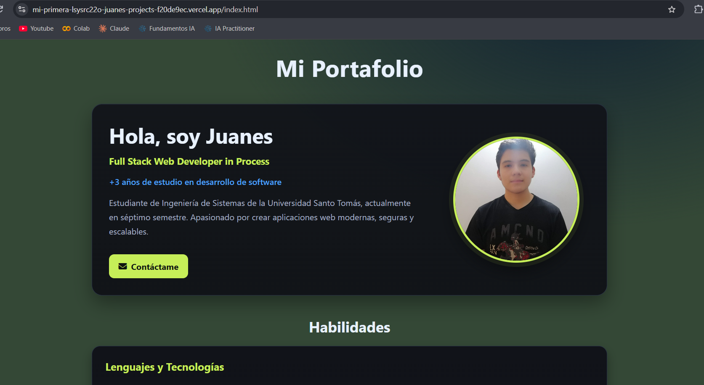
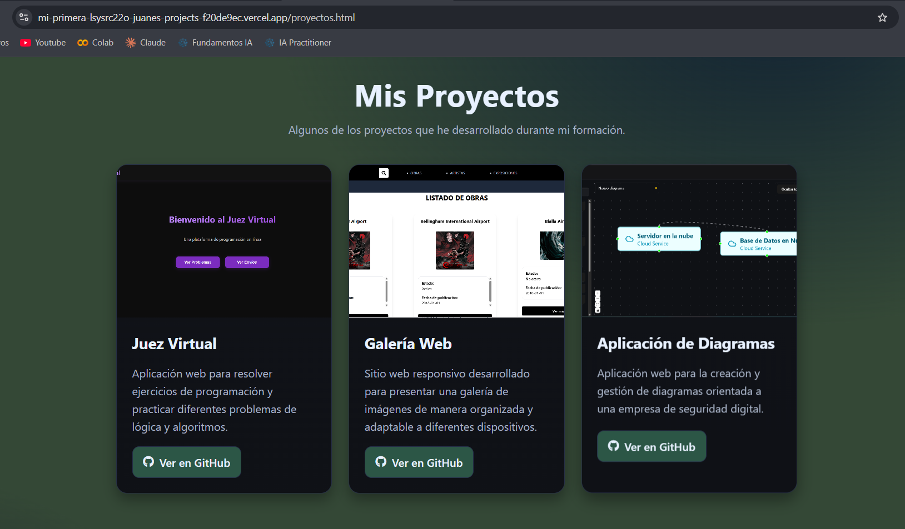
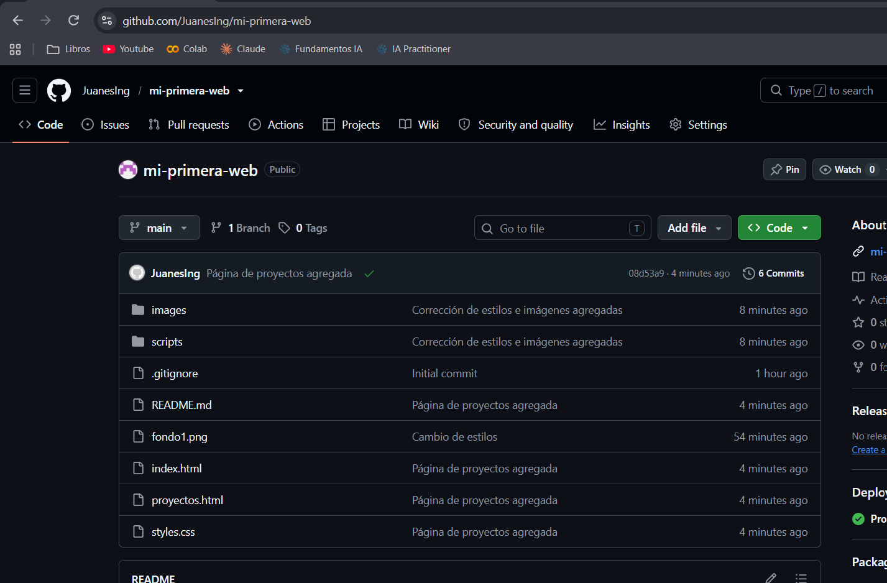
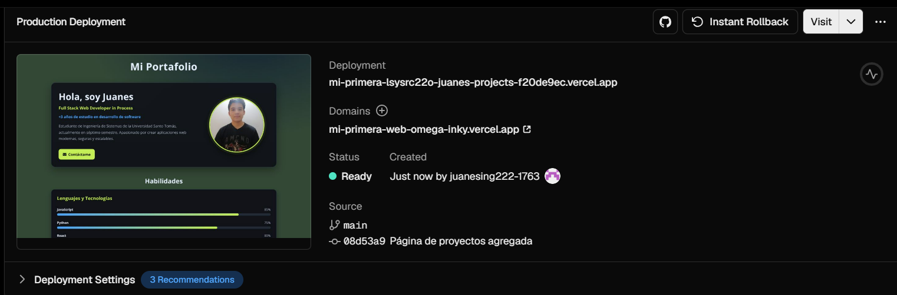

# 🌐 Hoja de Vida Web — Juanes

## 📌 Descripción

Este proyecto corresponde a una **entrega individual** de una hoja de vida web desarrollada utilizando tecnologías web básicas.

La página presenta información personal y académica, habilidades y tecnologías conocidas, además de enlaces a perfiles profesionales y proyectos desarrollados.

---

## 👨‍💻 Información del estudiante

- **Nombre:** Juanes
- **Carrera:** Ingeniería de Sistemas
- **Semestre:** Séptimo semestre
- **Perfil:** Full Stack Web Developer in Process

---

## 🛠️ Tecnologías utilizadas

- HTML5
- CSS3
- JavaScript
- Font Awesome
- Git
- GitHub

---

## 📂 Estructura del proyecto

```text
hoja-de-vida-web/
│
├── index.html
│
├── styles/
│   └── styles.css
│
├── scripts/
│   └── script.js
│
├── images/
│   ├── perfil1.jpg
│   ├── Judge.png
│   ├── galery.png
│   └── Diagram.png
│
└── README.md
```

---

## 📋 Requisitos de la entrega

| Requisito                          | Estado |
| ---------------------------------- | ------ |
| Entrega individual                 | ✅     |
| Repositorio público en GitHub      | ✅     |
| Nombre profesional del repositorio | ✅     |
| Archivo `index.html`               | ✅     |
| Archivo `styles.css`               | ✅     |
| Nombre del estudiante              | ✅     |
| Carrera                            | ✅     |
| Semestre                           | ✅     |
| Habilidades y tecnologías          | ✅     |
| Enlace a LinkedIn                  | ✅     |
| Enlace a GitHub                    | ✅     |
| README.md                          | ✅     |
| Evidencias                         | ✅     |
| URL pública                        | ✅     |

---

## 💻 Contenido de la página

La página web contiene las siguientes secciones:

### 👋 Perfil

Incluye:

- Nombre.
- Carrera.
- Semestre.
- Descripción profesional.
- Años de estudio en desarrollo de software.
- Fotografía de perfil.

### 🧠 Habilidades

Se presentan las principales tecnologías y el nivel aproximado de conocimiento:

- JavaScript — 85%
- Python — 75%
- React — 80%
- Node.js — 70%

### 🚀 Proyectos

La página incluye una sección con proyectos desarrollados anteriormente y enlaces a sus respectivos repositorios.

### 🔗 Redes profesionales

La página contiene enlaces a:

- GitHub
- LinkedIn

---

## 📸 Evidencias

### 1. Página principal



### 2. Sección de proyectos



### 4. Repositorio en GitHub



### 5. Página desplegada



`images/`.

---

## 🔗 Enlaces

### 📁 Repositorio de GitHub

**Repositorio:**
https://github.com/JuanesIng/mi-primera-web

### 💼 LinkedIn

**Perfil:**
https://www.linkedin.com/in/juan-tovara-data/

### 🐙 GitHub

**Perfil:**
https://github.com/JuanesIng

### 🌎 Página web publicada

**URL:**
https://mi-primera-lsysrc22o-juanes-projects-f20de9ec.vercel.app/proyectos.html

---

## 🚀 Despliegue

El proyecto puede ser desplegado utilizando servicios como:

- Vercel
- Firebase Hosting
- GitHub Pages

Una vez realizado el despliegue, la URL pública debe agregarse en la sección **"Enlaces"** de este README.

---

## 👤 Autor

**Juanes**
Estudiante de Ingeniería de Sistemas — Séptimo semestre.

- GitHub: https://github.com/JuanesIng
- LinkedIn: https://www.linkedin.com/in/juan-tovar-arias-079417348/

---

## 📄 Licencia

Este proyecto fue desarrollado con fines académicos.
